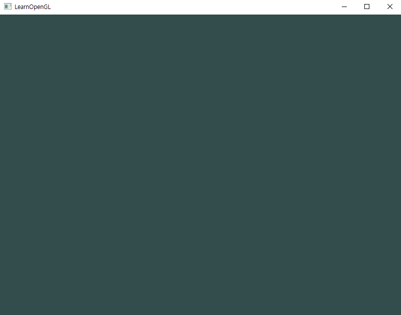

# Learn Open GL

https://learnopengl.com 를 구현 프로젝트 입니다.

하나의 솔루션 아래 여러가지 프로젝트로 구성되어 있습니다.


cmake로 빌드된 glfw3.lib가 필요합니다.


## Window 




윈도우를 생성한후 배경색을 설정함

```c++
...

//glfw window 생성
GLFWwindow* window = glfwCreateWindow(800, 600, "LearnOpenGL", NULL, NULL);
if (window == NULL) {
	std::cout << "Failed to create GLFW window" << std::endl;
	glfwTerminate();
	return -1;
}
glfwMakeContextCurrent(window);

...
    
//render loop
    
...
    
glClearColor(0.2f, 0.3f, 0.3f, 1.0f);
glClear(GL_COLOR_BUFFER_BIT);

...
```


## Triangle


기본 삼각형

```c++
    float vertices[] = {
        -0.5f, -0.5f, 0.0f,
         0.5f, -0.5f, 0.0f,
         0.0f,  0.5f, 0.0f
    }; 

    ...

    glBindVertexArray(VAO);
    glBindBuffer(GL_ARRAY_BUFFER, VBO);
    glBufferData(GL_ARRAY_BUFFER, sizeof(vertices), vertices, GL_STATIC_DRAW);
    glVertexAttribPointer(0, 3, GL_FLOAT, GL_FALSE, 3 * sizeof(float), (void*)0);
    glEnableVertexAttribArray(0);

    ...

            //render loop

    ...

    //삼각형 그리기
    glUseProgram(orangeTriangle);
    glBindVertexArray(VAO[0]);
    glDrawArrays(GL_TRIANGLES, 0, 3);

    ...
```


```c++
    float firstTriangle[] = {
        -0.9f, -0.5f, 0.0f,  // left 
        -0.0f, -0.5f, 0.0f,  // right
        -0.45f, 0.5f, 0.0f,  // top 
    };
    float secondTriangle[] = {
        0.0f, -0.5f, 0.0f,  // left
        0.9f, -0.5f, 0.0f,  // right
        0.45f, 0.5f, 0.0f   // top 
    };


	...
    
	//render loop
   
	...
    
    glUseProgram(shaderProgram);
    glBindVertexArray(VAO);
    glDrawArrays(GL_TRIANGLES, 0, 6);

	...
```


```c++
unsigned int orangeTriangle = CompileShader(vertexShaderSource, fragmentShaderSource);
unsigned int greenTriangle = CompileShader(vertexShaderSource, fragmentShaderSource2);

	...
    
    //삼각형 정점 설정
	float vertices[] = {
		-0.9f, -0.5f, 0.0f,  // left 
		-0.0f, -0.5f, 0.0f,  // right
		-0.45f, 0.5f, 0.0f,  // top 
	};

	float vertice2[] = {
		 0.0f, 0.5f, 0.0f,  // left
		 0.9f, 0.5f, 0.0f,  // right
		 0.45f,-0.5f, 0.0f   // top 
	};

	...
    
    //render loop
    
    glUseProgram(orangeTriangle);
	glBindVertexArray(VAO[0]);
	glDrawArrays(GL_TRIANGLES, 0, 3);


	glUseProgram(greenTriangle);
	glBindVertexArray(VAO[1]);
	glDrawArrays(GL_TRIANGLES, 0, 3);
    
    ...
```


## Rectangle


```c++
	float vertices[] = {
		 0.5f,  0.5f, 0.0f,  // 우측 상단
		 0.5f, -0.5f, 0.0f,  // 우측 하단
		-0.5f, -0.5f, 0.0f,  // 좌측 하단
		-0.5f,  0.5f, 0.0f   // 좌측 상단
	};

	unsigned int indices[] = {  // 0부터 시작한다는 것을 명심하세요!
	0, 1, 3,   // 첫 번째 삼각형
	1, 2, 3    // 두 번째 삼각형
	};

	//Vertex Buffer object(VBO),Vertex Array Object(VAO)
	unsigned int VBO, VAO, EBO;

	//gen
	glGenVertexArrays(1, &VAO);
	glGenBuffers(1, &VBO);
	glGenBuffers(1, &EBO);

	//bind
	glBindVertexArray(VAO);

	glBindBuffer(GL_ARRAY_BUFFER, VBO);
	glBufferData(GL_ARRAY_BUFFER, sizeof(vertices), vertices, GL_STATIC_DRAW);
	
	glBindBuffer(GL_ELEMENT_ARRAY_BUFFER, EBO);
	glBufferData(GL_ELEMENT_ARRAY_BUFFER, sizeof(indices), indices, GL_STATIC_DRAW);

	glVertexAttribPointer(0, 3, GL_FLOAT, GL_FALSE, 3 * sizeof(float), (void*)0);
	glEnableVertexAttribArray(0);

	...
    
        //render loop
    
        ...
    
	glUseProgram(shaderProgram);
	glBindVertexArray(VAO);
	glDrawElements(GL_TRIANGLES, 6, GL_UNSIGNED_INT, 0);

```


## Shader


shader클래스 추가


```c++
	//render loop
	while (!glfwWindowShouldClose(window))
	{
		processInput(window);

		//gl배경색
		glClearColor(0.2f, 0.3f, 0.3f, 1.0f);
		glClear(GL_COLOR_BUFFER_BIT);

		//삼각형 그리기
		progame.use();
		float timeValue = glfwGetTime();
		float greenValue = sin(timeValue) / 2.0f + 0.5f; //항상 양수
		int vertexColorLocation = glGetUniformLocation(progame.ID, "ourColor");
		glUniform4f(vertexColorLocation, 0.0f, greenValue, 0.0f, 1.0f);

		glBindVertexArray(VAO);
		glDrawElements(GL_TRIANGLES, 3, GL_UNSIGNED_INT, 0);


		glfwSwapBuffers(window);
		glfwPollEvents();
	}
```

유니폼을 사용한 shader